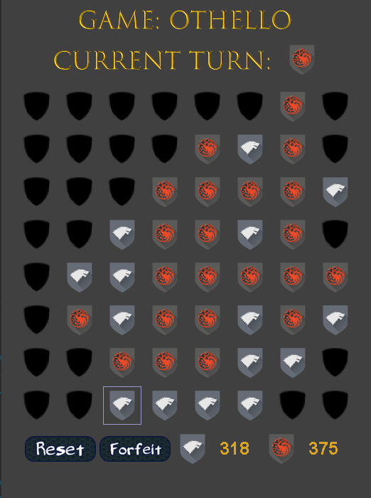

# Othello Game

**Author:** Abhi Bashyal

**Purpose:** This project implements a basic Othello game with a graphical user interface using Java.

## Description

Othello is a board game played on an 8x8 grid. Players take turns placing discs of their color on the board. When a disc is placed, it captures any opposing discs that are sandwiched between it and another of the player's discs in a straight line (horizontally, vertically, or diagonally). The game ends when no more valid moves can be made, or the board is full. The player with the most discs on the board at the end wins.

## Features

- **GUI:** Interactive game play with a visual representation of the board, player turn indicator, score display, and game over messages.

     
  
- **Game Logic:** Implements core Othello rules, including:
    - Valid move checking
    - Disc placement and flipping
    - Score calculation
    - Win/lose/draw conditions


- **User Interaction:** Handles mouse clicks for disc placement and provides basic user feedback.
 

- **Reset Functionality:** Allows players to reset the game and start a new match.


## Code Structure

- **Othello.java:** Main class containing the game logic, GUI elements, and event handling.

## Running the Game

You can run the Othello game using **Eclipse** or through an **HTML file**. Here are the steps for each method:

### **Running the Game Using Eclipse:**

1. **Install Eclipse:**
   - If you haven't already, download and install **Eclipse IDE** from [here](https://www.eclipse.org/downloads/).

2. **Create a New Java Project in Eclipse:**
   - Open Eclipse and go to **File > New > Java Project**.
   - Name the project (e.g., `OthelloGame`) and click **Finish**.

3. **Add the Othello.java File:**
   - Right-click on the **src** folder within the project and select **New > Class**.
   - Name the class `Othello` and paste the game code into the editor.
   - Alternatively, if you already have the `Othello.java` file, you can import it by right-clicking the **src** folder and selecting **Import > General > File System**. Then browse to the file location and finish the import.

4. **Run the Game:**
   - Once the file is open in the Eclipse editor, click the **Run** button (green circle with a white arrow) in the toolbar, or right-click on `Othello.java` in the Project Explorer and select **Run As > Java Application**.
   - The game will compile and run within Eclipse, showing the GUI and allowing you to play.

### **Running the Game Using HTML:**

If you prefer to run the game as a Java Applet in a web browser, follow these steps:

1. **Compile the Java Code:**
   - Make sure the `Othello.java` file is compiled into a `.class` file using the following command:
     ```bash
     javac Othello.java
     ```

2. **Ensure the Applet Code is Included:**
   - The game should have the required Java Applet code to display the GUI in the browser. This might involve creating an `applet` tag in an HTML file (if your game is set up as an applet).

3. **Run the HTML File:**
   - Open the **Othello.html** file in a web browser that supports Java Applets.
   - Note that modern browsers may no longer support Java Applets, so you may need to use older versions of browsers (like Internet Explorer) or a specific setup like **AppletsViewer** (a utility for running applets).

---
